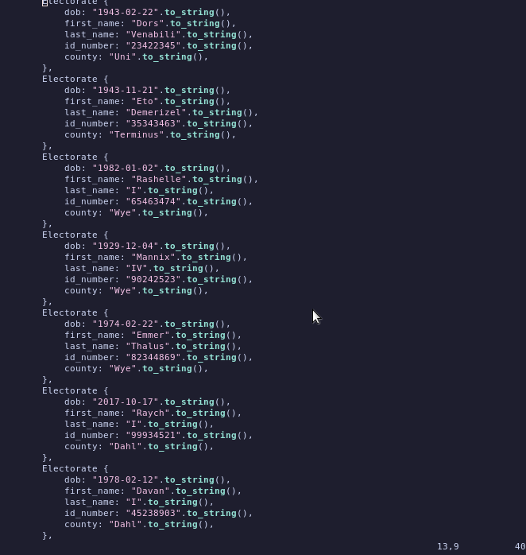

# Cracy
There is political tension brewing in Terminus.  
Cleon the first is struggling to keep the empire from crumbling.  
Mannix IV and her daughter Rashelle are determined to expoit the  
expanding social fault lines to bring a change of rule.  
While possible, this endeavor places Terminus and the rest of the empire at great peril.  
The wise Demerizel convinces all involved parties that an election would try and prolong the eventual fall of the empire, and they agree.  
[Bryo13](https://github.com/bryo13) is chosen 😢 to develop the election system and chooses the Rust language to create the election system.  
With the assistance of the ever reliable SQLite, and the fate of the empire, this code is set to be the glue that holds the empire together.  
Just long enough.  

## Rules set out for the election
- A person would choose their prefered candidate
- Their less prefered candidate and so on until their least prefered candidate
- To try and prevent spoilt votes, the electorate would have to go through all candidates in order  for the votes to count.
- The total tally of the votes would determine the winner.  
and should hold 50 + 1 % of the votes cast. i.e more than half the electorate choose the candidate as their prefered candidate

## Sample seed data
Since for one to vote, data already in the db would be required, specifically electorate's ID number 

## Running
Adding the deps in Cargo.toml in your system should do the trick
i.e
```bash
cargo build
```

## Inspiration
A [Veritasium](https://www.youtube.com/watch?v=qf7ws2DF-zk) youtube video
 on democracy got me thinking a small model simulating an election
 would be a good tool to learn rust.
